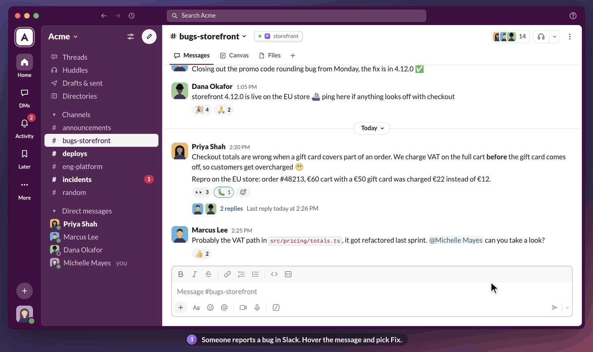
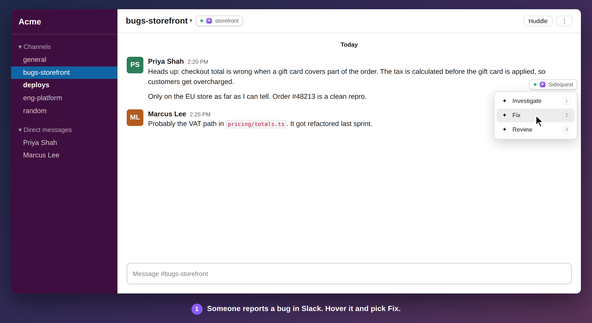

#  Sidequest

**Turn any Slack message into a coding-agent session in one click.**

Someone reports a bug in Slack. You hover the message and click **Sidequest → Fix**.
A few seconds later a Warp tab is open on a fresh git worktree, and Claude Code (or
Codex) is already working on it, with the message and its thread as the prompt.



<sub>End to end: the real overlay over a mock channel, then the Warp tab it opens and the
agent committing a fix on the new branch (the terminal is scripted for the recording).
See [`docs/demo`](docs/demo) to re-record it.</sub>

- **No Slack app, no bot token, no workspace install.** Sidequest attaches to the
  Slack desktop app you already use.
- **Nothing leaves your machine.** The message goes from Slack's window into a
  prompt file on disk. (Unless you turn on thread replies, which post to Slack as you.)
- **Your checkout is never touched.** Every session gets its own branch and
  worktree, cut from an up-to-date base branch.

## Quick start

You'll need macOS, Node 20+, git, [Warp](https://www.warp.dev/), and
[Claude Code](https://claude.com/claude-code) or [Codex](https://github.com/openai/codex)
on your `PATH`.

```bash
git clone https://github.com/michellemayes/Sidequest.git
cd Sidequest
npm install && npm run build && npm link
sidequest setup          # config, shell hook, checks, then relaunches Slack with the overlay
```

`setup` runs `init`, `install-hook`, `doctor` and `start` in turn, and is safe to
run again.

**Updating** is one command, from anywhere:

```bash
sidequest update
```

It pulls the latest, runs `npm ci` only when `package.json` or
`package-lock.json` changed (most updates skip it), builds into a scratch folder
and swaps it in only if the build succeeds, and restarts the daemon if it was
running. When there's nothing new to pull, it still restarts a daemon that is
running an older build (say, after an earlier `--no-restart`). If anything fails, the checkout goes back to the version you had, so a
bad update never leaves you with a broken install. It refuses to run over local
edits in the checkout. Then, in Slack:

1. Hover any message → **Sidequest**. In a channel with no repo yet, the menu
   suggests the checkouts on your machine that match the channel's name (for
   `#storefront-eng`, that's `storefront`). One click links it and shows the prompts.
2. Pick **Investigate**, **Fix**, **Review** or **Ask**, or press **1**–**4**
   (or **I**/**F**/**R**/**A**).

A channel can have more than one repo. Add another from the repo button beside
the channel name (it lists the channel's repos, each with **×** to unlink it),
or with `sidequest link`. The menu then shows a row of the channel's repos above
the prompts: click one, or press **←**/**→**, to pick where the session runs.
It opens on the repo the channel's last session used.

A toast confirms the launch with your running count, today's count and your
day streak. The branch name, or the error if something went wrong, shows up
under the message; click it to reopen the session, or **×** to dismiss it.

Messages you've already started a session from keep a small **✦ Fix** mark.
Click it to jump back into that session. Its menu also leads with **Back to Fix**,
so you don't cut a duplicate branch by accident.

| | What the agent does |
| --- | --- |
| **Investigate** | Reproduces the problem, traces it to the code, explains it and recommends a fix. Changes nothing. |
| **Fix** | Finds the root cause, makes the smallest fix, adds a test, gets lint and tests passing, and commits. |
| **Review** | Reviews the referenced PR, branch or diff, bugs first. Changes nothing. |
| **Ask** | Opens a small box in the menu for your question (**Enter** to send, **Shift+Enter** for a new line, **Esc** to cancel). The agent gets the message, the thread and your question, reads the relevant code, and answers it. Send it empty and the agent just reads and waits for you. |
| **Linear** | Only on a message that links a Linear issue, and named for it (**Linear DATA-3051**). Reads the ticket, fixes it, and commits with the issue ID on a `linear/data-3051-…` branch, so Linear links the branch back. |
| **GitHub** | Only on a message that links a GitHub issue (**GitHub #123**). Reads it (with `gh issue view` when it can), fixes it, and commits on an `issue/123-…` branch with `Fixes owner/repo#123`, so merging closes the issue. |
| **Jira** | Only on a message that links a Jira ticket, on Jira Cloud or your own server (**Jira ABC-123**). Reads it, fixes it, and commits with the key on a `jira/ABC-123-…` branch, so Jira's development panel picks both up. |

A message that links more than one ticket gets a prompt for each of the first
two, in the order they appear. Only full links count: a bare `#123` could be
any repo's.

## How it works

Slack's desktop app is built on Electron. `sidequest start` launches it with
`--remote-debugging-port` and injects a small overlay
([`client/inject.js`](client/inject.js)) over the Chrome DevTools Protocol. The
overlay reads the message, its thread, the sender and the permalink from the page,
and a local daemon then:

1. creates `git worktree add -b <branch> <path> origin/<base>`,
2. writes the prompt to `<worktree>/.sidequest/prompt.md` (git-excluded),
3. opens Warp on the worktree and starts your agent.



The overlay sits in its own shadow-DOM layer and never modifies Slack's DOM. It
picks up your Slack theme and moves out of the way of Slack's own buttons.

## CLI

| Command | What it does |
| --- | --- |
| `sidequest setup` | First run in one command: config, shell hook, checks, start |
| `sidequest start` / `stop` / `status` | Run the background daemon (logs in `~/.sidequest/sidequest.log`) |
| `sidequest update` | Pull the latest and rebuild, reinstalling dependencies only if they changed; restarts a running daemon (`--no-restart` to skip) |
| `sidequest doctor` | Check git, Warp, the agent, Slack.app, the debug port, and whether the build is current |
| `sidequest sessions` | List every worktree Sidequest created |
| `sidequest reopen [ref]` | Reopen Warp on a session (the latest if you name none) |
| `sidequest stats` | Your total, today's count, current and best streak |
| `sidequest clean` | Remove merged worktrees. It won't delete uncommitted work unless you pass `--force` |
| `sidequest link <path> -c <channel>` | Link a repo to a channel from the terminal. Linking a second repo adds it; the first stays the default |
| `sidequest unlink [repo] -c <channel>` | Unlink one repo (by path or label) from a channel, or all of them if you name none |
| `sidequest replies [on\|off]` | Show the thread replies sessions post, or turn them on or off |
| `sidequest agents [claude\|codex]` | Show the available agents, or switch the one new sessions use |
| `sidequest list` / `prompts` | Show linked channels and prompt templates |

## Configuration

Everything lives in `~/.sidequest/config.json`.

**Prompts.** Override any of the templates or labels. Anything you leave out
keeps its default:

```json
{
  "prompts": {
    "fix": {
      "label": "Patch",
      "template": "Fix this, reported by @{{author}} in #{{channel}}:\n{{message}}\n\nCommit on {{branch}}."
    },
    "github": { "branchPrefix": "gh" },
    "jira": { "template": "Work {{ticketId}} ({{ticket}}) from #{{channel}}:\n{{message}}\n\nPut {{ticketId}} in every commit." }
  }
}
```

The keys are `investigate`, `fix`, `review`, `ask`, `linear`, `github` and `jira`.

Tokens: `{{author}}` `{{channel}}` `{{message}}` `{{thread}}` `{{permalink}}`
`{{date}}` `{{branch}}` `{{baseBranch}}` `{{repo}}` `{{worktree}}`, plus
`{{ticket}}` (the link) and `{{ticketId}}` (`DATA-3051`, `owner/repo#123` or
`ABC-123`) for Linear, GitHub and Jira, and `{{question}}` (what you typed in
the Ask box, empty otherwise). Sidequest
leaves unknown tokens in the prompt as written, so typos are easy to spot.

**Thread replies.** Turn on `autoReply` (or run `sidequest replies on`) and
starting a session also posts a short reply, as you, in the thread of the
message you started it from, so whoever asked knows it's being handled:

| | Default reply |
| --- | --- |
| **Investigate** | Investigating this. |
| **Fix** | Working on a fix. |
| **Review** | Reviewing this. |
| **Ask** | Looking into this: _what you typed in the Ask box_ |
| **Linear** | Picking up DATA-3051. |
| **GitHub** | Picking up owner/repo#123. |
| **Jira** | Picking up ABC-123. |

Each prompt's `reply` sets its text and takes the same tokens as its template
(`{{repo}}` is the repo's label, and `{{question}}` is just what you typed,
without a heading). With nothing typed in the Ask box, its reply is
"Looking into this." An empty `reply` turns it off for that prompt:

```json
{
  "settings": { "autoReply": true },
  "prompts": {
    "fix": { "reply": "On it, fixing this now." },
    "review": { "reply": "" }
  }
}
```

**Settings** (under `settings`):

| Setting | Default | |
| --- | --- | --- |
| `agent` | `{ "id": "claude" }` | `claude` or `codex` (or run `sidequest agents codex`). Use `command`/`args` to override the executable |
| `worktreesRoot` | `~/.sidequest/worktrees` | Where worktrees go |
| `warpStrategy` | `auto` | `auto` tries a tab config, then a launch config, then a plain new tab, until the agent starts. `tab_config`, `launch_config` or `new_tab` puts that one first |
| `warpPreview` | `false` | Use Warp Preview |
| `fetchBeforeCreate` | `true` | Fetch the base branch first. A fetch slower than 3 seconds doesn't hold up the session: it's cut from the local ref while the fetch finishes in the background |
| `repoSearchRoots` | `[]` | Where to look for repos to suggest. Empty means `~/code`, `~/src`, `~/Developer`, `~/projects` and similar, two levels deep |
| `threadContextLimit` | `10` | How many earlier messages go into the prompt |
| `pruneBranchesOnClean` | `true` | Delete merged branches on `clean` |
| `cdpPort` | `9222` | DevTools port for Slack |
| `relaunchSlack` | `true` | While Sidequest runs, relaunch a Slack reopened from the Dock (without the DevTools port) so the overlay comes back |
| `targetUrlPattern` | `app\.slack\.com\|/client/` | Which windows count as Slack |
| `autoReply` | `false` | Reply in the message's thread when a session starts. See Thread replies above |
| `verbose` | `false` | Log overlay activity to Slack's devtools console |

## Troubleshooting

Start with `sidequest doctor`.

- **"Slack is running without --remote-debugging-port"**: Slack only accepts
  the flag at launch. Run `sidequest start --force`.
- **The overlay is gone after quitting and reopening Slack**: a Slack opened
  from the Dock has no DevTools port, so the running daemon quits it and
  relaunches it with the port within a couple of seconds. If that doesn't
  happen, check `sidequest status` (the daemon has to be running) and the log.
- **No buttons**: hover a message first. If `sidequest status` shows zero
  attached windows, the overlay wasn't injected.
- **"Something other than Slack is listening on 127.0.0.1:9222"**: quit that
  app, or set `cdpPort` to a free port and run `start --force`.
- **The repo I want isn't suggested**: add its parent folder to
  `repoSearchRoots`, or paste the path into the channel pill's panel.
- **Warp opens but the agent doesn't start**: Sidequest opens a Warp tab config
  first, which Warp picks up while it's running. Launch configurations, the old
  default, are only read when Warp starts, so a deeplink to one just focuses
  Warp. If neither starts the agent, Sidequest opens a plain tab on the
  worktree, where the shell hook takes over: run `sidequest install-hook` and
  open a new Warp tab. `~/.sidequest/sidequest.log` shows which strategy was
  tried. Then retry, or run `sidequest reopen` (latest) / `sidequest reopen <branch>`.
- **Warp doesn't open**: the worktree still exists. `cd` into it and run
  `.sidequest/autorun.sh`.

## Security

The overlay only talks to the local daemon. The one exception is the thread
reply, which is off unless you turn on `autoReply`: the overlay then posts it
to your workspace's own Slack API with the session Slack's window is already
signed in with. That token stays in the window and never reaches the daemon.
Sidequest runs commands from argv arrays, never through a shell, and passes the
prompt in a file, so message text can't inject commands. The overlay runs inside
Slack's window, so what the daemon sends it is visible there: channel links,
prompt labels, past sessions' branch names, and (only while a link menu or panel
is open) the paths of the repos it suggests. Session history is kept in
`~/.sidequest/history.json`. The DevTools port is
bound to `127.0.0.1`, which means other processes running as your user can reach
it, as with any Electron app that has remote debugging on.

## Development

```bash
npm run dev -- doctor   # run from source
npm test                # unit, git integration, and headless-Chromium e2e tests
npm run typecheck
```

## License

MIT
